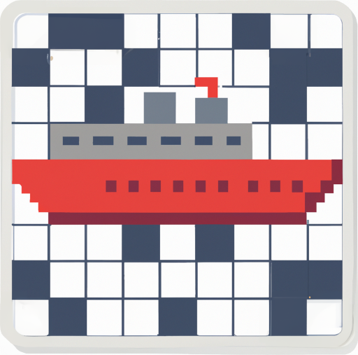

<!--
SPDX-FileCopyrightText: 2023 Antoine Belvire
SPDX-License-Identifier: GPL-3.0-or-later
-->

## Croiseur

**Croiseur**[^1] is a software for creating crossword puzzles. It has the following features:

* It embeds [dictionaries][] for multiple languages;
* It provides several crossword [solvers][] capable of finding various grid fillings;
* It can be used through a simple [desktop application][] for manual authoring, as well as a
  [command-line interface][] for automation;
* It is designed to be [extensible][]: Solvers, dictionaries and even user interfaces can be plugged
  to a core component.

### Getting Started 🚀

As a crossword enthusiast, you may be interested in creating your crossword puzzle right away with
**[croiseur-gui][]**, a desktop application based on Croiseur.

As a command-line fan, you may be interested in **[croiseur-cli][]**, a command-line interface to
Croiseur.

Need more? Check the [project documentation][]!

### Licence ⚖️

This work is a free software licenced under multiple licences:

* The original code is licenced under [GPL-3.0-or-later][];
* Code and data reused from other projects are licenced under either GPL-3.0-or-later or
  compatible free software licences listed in the [LICENCES][] folder.

You may use the [reuse tool][] to generate a
comprehensive listing of all the files with their associated licences.

<!-- Reference Links -->

[command-line interface]: croiseur-cli

[croiseur-cli]: croiseur-cli

[desktop application]: croiseur-gui

[croiseur-gui]: croiseur-gui

[dictionaries]: doc/reference/Available-service-providers.md#dictionary-list

[extensible]: croiseur-spi

[GPL-3.0-or-later]: LICENSES/GPL-3.0-or-later.txt

[LICENCES]: LICENSES

[platforms]: https://wiki.openjdk.org/display/Build/Supported+Build+Platforms

[project documentation]: doc

[reuse tool]: https://github.com/fsfe/reuse-tool

[solvers]: doc/reference/Available-service-providers.md#solvers

---

[^1]: [_croiseur_](https://en.wiktionary.org/wiki/croiseur) is the French name for _cruiser_
(battleship). It can also be literally understood as _the one who does crosses_ (_croi\[x\]_ is
_cross_, and _-eur_ is equivalent to the English suffix _-er_).
