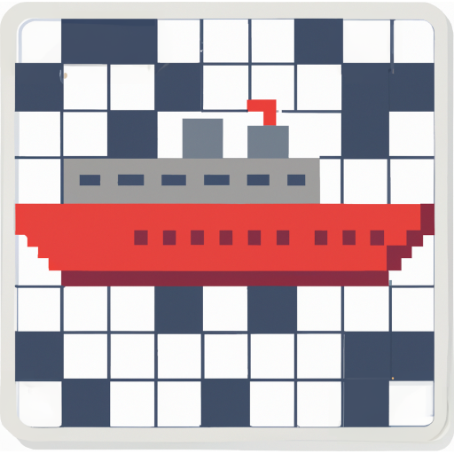

<!--
SPDX-FileCopyrightText: 2023 Antoine Belvire
SPDX-License-Identifier: GPL-3.0-or-later
-->

## croiseur

.

**croiseur**[^1] is a software for generating crossword problems. It is written mainly in Java
and thus can run on many [platforms][]. It embeds [dictionaries][] for
multiple languages as well as a couple of crossword [solvers][]. It is designed to be
extensible: Solvers, dictionaries and even user interfaces can be plugged to a core component.

### Getting Started

As a crossword enthusiast, you may be interested in creating your crossword puzzle right away with
**[croiseur-gui][]**, a desktop application based on **croiseur**.

As a command-line fan, you may be interested in **[croiseur-cli][]**, a command-line interface to
**croiseur**.

Need more? Check the [project documentation](doc)!

### Licence

This work is a free software licenced under multiple licences:

* The original code is licenced under [GPL-3.0-or-later][];
* Code and data reused from other projects are licensed under either GPL-3.0-or-later or
  compatible free software licences listed in the [LICENCES][] folder.

You may use the [reuse tool](https://github.com/fsfe/reuse-tool) to generate a
comprehensive listing of all the files with their associated licences.

<!-- Reference Links -->

[croiseur-cli]: ./croiseur-cli

[croiseur-gui]: ./croiseur-gui

[dictionaries]: ./doc/references/0001-available-providers.md#dictionary-list

[GPL-3.0-or-later]: ./LICENSES/GPL-3.0-or-later.txt

[LICENCES]: LICENSES

[platforms]: https://wiki.openjdk.org/display/Build/Supported+Build+Platforms

[solvers]: ./doc/references/0001-available-providers.md#solvers

---

[^1]: [_croiseur_](https://en.wiktionary.org/wiki/croiseur) is the French name for _cruiser_
(battleship). It can also be literally understood as _the one which does crosses_ (_croi\[x\]_ is 
_cross_, and _-eur_ is equivalent to the English suffix _-er_).