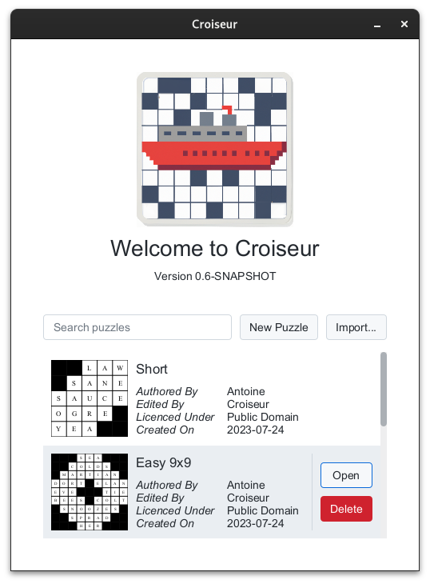
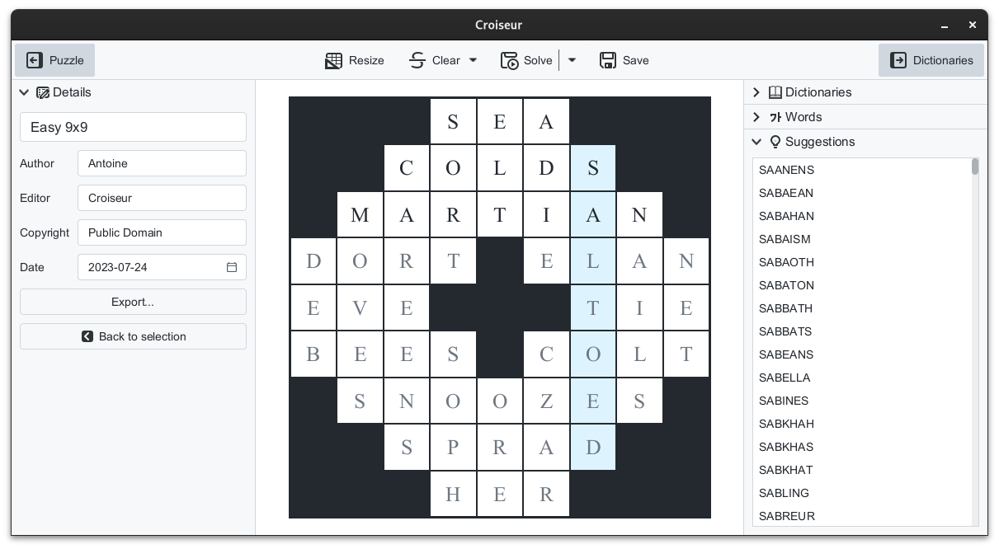

<!--
SPDX-FileCopyrightText: 2023 Antoine Belvire
SPDX-License-Identifier: GPL-3.0-or-later
-->

## Croiseur GUI

**Croiseur GUI** is a desktop application allowing to create crossword puzzles. It is a 
frontend to the `croiseur` library.

### Installation

Refer to [INSTALL.md](INSTALL.md).