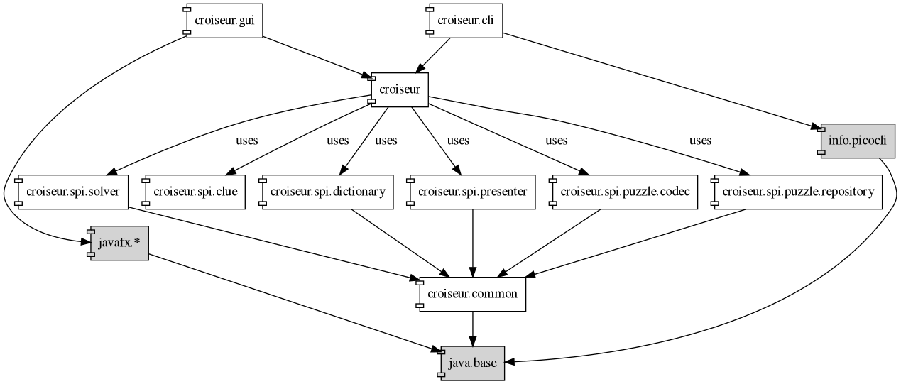
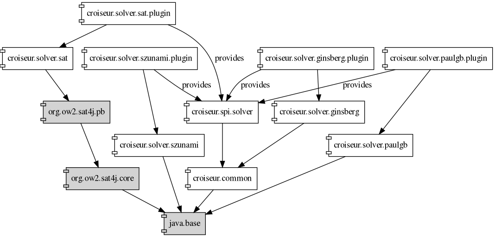

<!--
SPDX-FileCopyrightText: 2023 Antoine Belvire
SPDX-License-Identifier: GPL-3.0-or-later
-->

## Reference: Component Descriptions

This page describes the software components of the Croiseur project.

### Decomposition

Here are the software components of Croiseur:

| Name                                               | Description                                                                                                                         |
|----------------------------------------------------|-------------------------------------------------------------------------------------------------------------------------------------|
| [`croiseur`][]                                     | Application core library                                                                                                            |
| [`croiseur-cli`][]                                 | Command-line frontend to `croiseur`                                                                                                 |
| [`croiseur-common`][]                              | Common types used as building blocks by all other modules                                                                           |
| [`croiseur-dictionary-common`][]                   | Collection of utility classes useful for implementing dictionary providers                                                          |
| [`croiseur-dictionary-hunspell-codec`][]           | Library which allows to read Hunspell dictionaries and generate all word forms from them                                            |
| [`croiseur-dictionary-hunspell-plugin`][]          | Dictionary provider of local word lists written as Hunspell dictionaries                                                            |
| [`croiseur-dictionary-txt-plugin`][]               | Dictionary provider of local word lists written as text files                                                                       | 
| [`croiseur-dictionary-xml-codec`][]                | Library which allows to read and write dictionaries in a custom XML format                                                          |                                                                               
| [`croiseur-dictionary-xml-plugin`][]               | Dictionary provider of local word lists written in XML                                                                              |
| [`croiseur-gui`][]                                 | Desktop application, frontend to `croiseur`                                                                                         |
| [`croiseur-gui-controller`][]                      | Controller submodule of `croiseur-gui` (calls `croiseur` service upon `croiseur-gui-view` events)                                   |
| [`croiseur-gui-presenter`][]                       | Presenter submodule of `croiseur-gui` (presents `croiseur` outputs by updating `croiseur-gui-view-model`)                           |
| [`croiseur-gui-view`][]                            | View submodule of `croiseur-gui` (widgets of `croiseur-gui`)                                                                        |
| [`croiseur-gui-view-model`][]                      | View-model submodule of `croiseur-gui` (a model representing the state of the views, observed and displayed by `croiseur-gui-view`) |
| [`croiseur-puzzle-codec-xd`][]                     | Library which allows to read/write puzzles in the xd format                                                                         |
| [`croiseur-puzzle-codec-xd-plugin`][]              | Puzzle codec provider adapting `croiseur-puzzle-codec-xd`                                                                           |
| [`croiseur-puzzle-repository-filesystem-plugin`][] | Puzzle repository implementation which stores puzzles as files on disk                                                              |
| [`croiseur-puzzle-repository-memory-plugin`][]     | Puzzle repository implementation whose storage is purely in memory - only used for tests                                            |                                           
| [`croiseur-solver-ginsberg`][]                     | Crossword solver library based on Matt Ginsberg's papers                                                                            |
| [`croiseur-solver-ginsberg-plugin`][]              | Solver provider adapting `croiseur-solver-ginsberg`                                                                                 |
| [`croiseur-solver-paulgb`][]                       | Crossword solver library based on paulgb's Crossword Composer                                                                       |
| [`croiseur-solver-paulgb-plugin`][]                | Solver provider adapting `croiseur-solver-paulgb`                                                                                   |
| [`croiseur-solver-szunami`][]                      | Crossword solver library based on szunami's xwords-rs                                                                               |
| [`croiseur-solver-szunami-plugin`][]               | Solver provider adapting `croiseur-solver-szunami`                                                                                  |
| [`croiseur-spi-dictionary`][]                      | Interface definition for dictionary providers                                                                                       |
| [`croiseur-spi-presenter`][]                       | Interface definition for presenters                                                                                                 |
| [`croiseur-spi-puzzle-codec`][]                    | Interface definition for puzzle codecs                                                                                              |
| [`croiseur-spi-puzzle-repository`][]               | Interface definition for puzzle repositories                                                                                        |
| [`croiseur-spi-solver`][]                          | Interface definition for solvers                                                                                                    |

In addition to these components, the following external components are used:

| Name      | Description                                        |
|-----------|----------------------------------------------------|
| `java`    | The Java platform                                  |
| `javafx`  | Framework for creating graphical user interface    |
| `picocli` | Framework for creating command-line user interface |

### Dependencies

<!-- Diagrams here were generated with jdeps then heavily modified by hand to keep the most
significant stuff. -->

The following conventions apply to all diagrams:

- Components are referenced via their simplified Java module names, which is their component names
  with the `-` separator replaced by `.`. The module's `com.gitlab.super7ramp.` prefix is omitted
  for brevity.
- Dependencies to `java.logging` are omitted (pervasive across the project).
- Direct dependencies are omitted when already provided by transitivity (i.e.
  if `A -> B`, `A -> C` and `B -> C`, then only `A -> B` and `B -> C` are represented).
- Nodes representing modules which are external to the project are filled with gray.

#### Overview

This diagram represents the main module dependencies, with the following omissions:

- Dictionary SPI implementations (see [dedicated section](#dictionary-spi-implementations) below)
- Puzzle codec SPI implementations (see [dedicated section](#puzzle-codec-spi-implementations)
  below)
- Puzzle repository SPI implementations
  (see [dedicated section](#puzzle-repository-spi-implementations) below)
- Solver SPI implementations (see [dedicated section](#solver-spi-implementations) below)
- GUI detailed dependencies (see [dedicated section](#gui-detailed-dependencies) below)

#### Dictionary SPI Implementations

#### Puzzle Codec SPI Implementations

#### Puzzle Repository SPI Implementations

#### Solver SPI Implementations

#### GUI Detailed Dependencies

Note: Some dependencies of `javafx.*` are omitted for clarity.

### Interfaces

Refer to the generated Javadoc (🚧).

<!-- Reference Links -->

[`croiseur`]: ../../croiseur

[`croiseur-cli`]: ../../croiseur-cli

[`croiseur-common`]: ../../croiseur-common

[`croiseur-dictionary-common`]: ../../croiseur-dictionary/croiseur-dictionary-common

[`croiseur-dictionary-hunspell-codec`]: ../../croiseur-dictionary/croiseur-dictionary-hunspell-codec

[`croiseur-dictionary-hunspell-plugin`]: ../../croiseur-dictionary/croiseur-dictionary-hunspell-plugin

[`croiseur-dictionary-txt-plugin`]: ../../croiseur-dictionary/croiseur-dictionary-txt-plugin

[`croiseur-dictionary-xml-codec`]: ../../croiseur-dictionary/croiseur-dictionary-xml-codec

[`croiseur-dictionary-xml-plugin`]: ../../croiseur-dictionary/croiseur-dictionary-xml-plugin

[`croiseur-gui`]: ../../croiseur-gui/croiseur-gui

[`croiseur-gui-controller`]: ../../croiseur-gui/croiseur-gui-controller

[`croiseur-gui-presenter`]: ../../croiseur-gui/croiseur-gui-presenter

[`croiseur-gui-view`]: ../../croiseur-gui/croiseur-gui-view

[`croiseur-gui-view-model`]: ../../croiseur-gui/croiseur-gui-view-model

[`croiseur-puzzle-codec-xd`]: ../../croiseur-puzzle/croiseur-puzzle-codec-xd

[`croiseur-puzzle-codec-xd-plugin`]: ../../croiseur-puzzle/croiseur-puzzle-codec-xd-plugin

[`croiseur-puzzle-repository-filesystem-plugin`]: ../../croiseur-puzzle/croiseur-puzzle-repository-filesystem-plugin

[`croiseur-puzzle-repository-memory-plugin`]: ../../croiseur-puzzle/croiseur-puzzle-repository-memory-plugin

[`croiseur-solver-ginsberg`]: ../../croiseur-solver/croiseur-solver-ginsberg

[`croiseur-solver-ginsberg-plugin`]: ../../croiseur-solver/croiseur-solver-ginsberg-plugin

[`croiseur-solver-paulgb`]: ../../croiseur-solver/croiseur-solver-paulgb

[`croiseur-solver-paulgb-plugin`]: ../../croiseur-solver/croiseur-solver-paulgb-plugin

[`croiseur-solver-szunami`]: ../../croiseur-solver/croiseur-solver-szunami

[`croiseur-solver-szunami-plugin`]: ../../croiseur-solver/croiseur-solver-szunami-plugin

[`croiseur-spi-dictionary`]: ../../croiseur-spi/croiseur-spi-dictionary

[`croiseur-spi-presenter`]: ../../croiseur-spi/croiseur-spi-presenter

[`croiseur-spi-puzzle-codec`]: ../../croiseur-spi/croiseur-spi-puzzle-codec

[`croiseur-spi-puzzle-repository`]: ../../croiseur-spi/croiseur-spi-puzzle-repository

[`croiseur-spi-solver`]: ../../croiseur-spi/croiseur-spi-solver