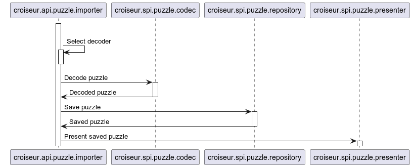
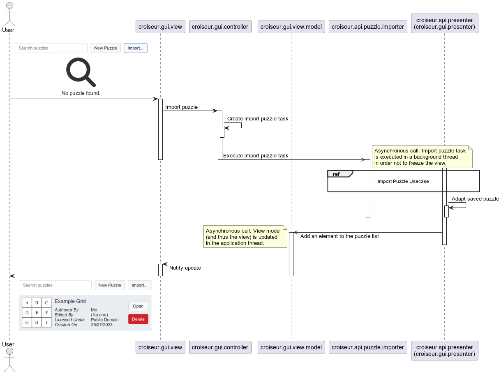
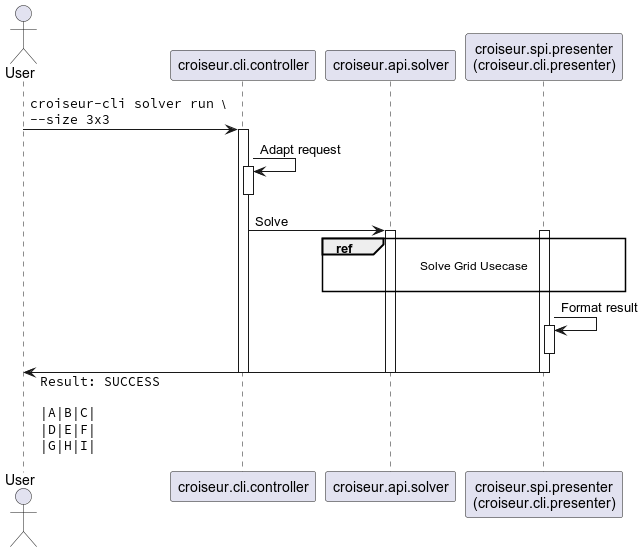

<!--
SPDX-FileCopyrightText: 2023 Antoine Belvire
SPDX-License-Identifier: GPL-3.0-or-later
-->

## Reference: Examples of Execution

### Conventions

The following sequence diagrams aim to give an understanding of the execution inside both
core `croiseur` library and applications using it.

They do not aim to:

- Describe other components internals (e.g. crossword solvers – this may be done in each solver
  project);
- Be precise enough for code generation.

With that in mind, the following conventions apply to all diagrams:

- No specific class name: Only package names are used (and some liberty may be taken to avoid
  mentioning implementation-private packages);
- Happy path only: Error handling is omitted.

### Puzzle Usecases

This section presents examples of execution for usecases related primarily to saved puzzles
management.

#### Import Puzzle

This is the usecase in which user requests to import a puzzle to the puzzle repository.

##### Core Fragment

This is the fragment showing the interactions driven by core library `croiseur`.

#### CLI

Here is the execution of `croiseur-cli` calling the core `croiseur` Import Puzzle usecase.

#### GUI

Here is the execution of `croiseur-gui` calling the core `croiseur` Import Puzzle usecase.

### Solver Usecases

This section presents examples of execution for usecases related primarily to the crossword solvers.

#### Solve Grid

This is the usecase in which user requests to solve a grid, i.e. to automatically fill the grid.

##### Core Fragment

This is the fragment showing the interactions driven by core library `croiseur`.

##### CLI

Here is the execution of `croiseur-cli` calling the core `croiseur` Solve Usecase.

##### GUI

Here is the execution of `croiseur-gui` calling the core `croiseur` Solve Usecase.

